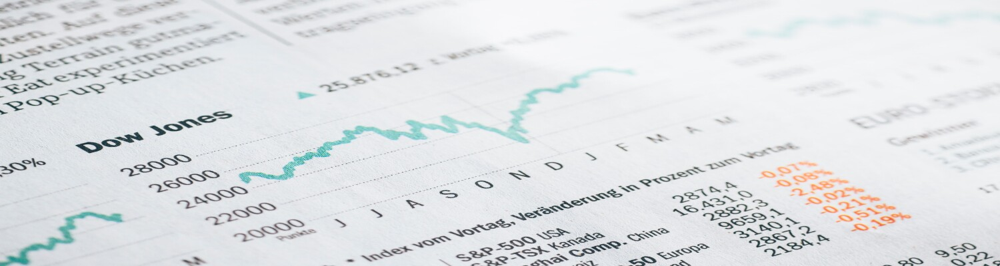

# Machine-Learning-Practice

:Stock Price Transition Forecast:
---

  

     
    ├── input
    │   ├── datasets       <- Datasets used in model
    │   └── images         <- Images used in README.md and Jupyter notebooks.
    │
    ├── notebooks          <- Jupyter notebooks. 
    │   └─── eda.ipnyb     <- Expolatory Data Analysis to know better about the datasets and prepare 
    │                         the dataset to the use in the final model
    │
    └─── src               <- Source code for use in this project.
    │   │
    │   └─── models       
    └── README.md

----

